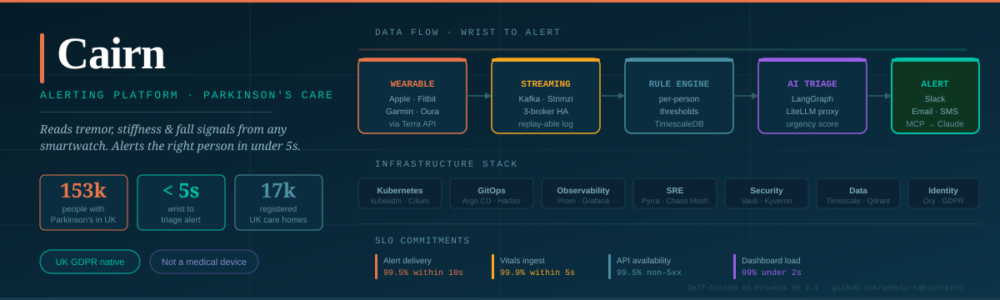
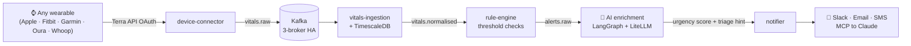

<div align="center">



<br/>

[](LICENSE)
[](https://kubernetes.io)
[](https://strimzi.io)
[](https://argoproj.github.io)
[](https://langchain-ai.github.io/langgraph/)
[](https://www.proxmox.com)
[](https://ico.org.uk)
[](https://github.com/adeolu-rabiu/cairn)

<br/>

### *Cairn quietly reads the signals from your smartwatch and alerts your carer, clinician, or family before small changes become falls.*

<br/>

[📋 Pitch deck](docs/cairn-pitch-deck.pdf) · [🏗️ Architecture](#-architecture) · [📐 SRE commitments](#-sre-commitments) · [🤝 Partnership](#-why-partner-with-cairn) · [👤 Author](#-author)

</div>

---

## ⚠️ The problem

Parkinson's progresses gradually. Subtle drifts in tremor, sleep quality, and heart-rate variability precede falls and acute events by **weeks** — but the signals are invisible unless someone is watching. They are not watching.

Care staff vacancy rates across UK adult social care sit at double-digit percentages. A typical resident's wearable data sits locked in five different vendor apps, firing raw numbers at overstretched staff with no context, no urgency cue, and no recommended action.

> **The result: alert fatigue and reactive care. Cairn fixes this.**

---

## 🩺 What Cairn does

Cairn reads **tremor, stiffness, HRV, sleep disruption, and movement** from the smartwatch a Parkinson's patient already wears. When the signals drift — a tremor spike, an uncharacteristic stillness, a nocturnal fall — a LangGraph AI agent pulls 24 hours of context, scores urgency, and dispatches an enriched, triage-ready alert to the right person **in under five seconds**.



> **Not a medical device. Not a clinical diagnostic. A force-multiplier for the people already doing the care.**

---

## 🏗️ Architecture

Nine colour-coded layers — hardware at the bottom, external services at the top. Every box is a deployable component. Click any box on the [interactive version](docs/cairn-architecture.svg).

<div align="center">

</div>

| Colour | Stack | Key components |
|---|---|---|
| 🟥 Pink | External services | Terra API · Cloudflare · Slack · Backblaze B2 |
| 🟧 Coral | AI layer | LiteLLM · LangGraph · MCP server |
| 🟩 Green | Application | Connector · Rule engine · Notifier · Dashboard |
| 🟨 Amber | Data plane | Kafka · PostgreSQL+TimescaleDB · Qdrant · Redis · MinIO · Harbor |
| 🟪 Purple | Platform | Argo CD · cert-manager · Vault+ESO · Kyverno |
| 🩵 Teal | Monitoring | Prometheus · Grafana · Loki · Tempo |
| 🔵 Blue | Kubernetes | cp-1 · worker-1 · worker-2 |
| ⬜ Gray | Proxmox VE | Hypervisor (KVM/QEMU) · vmdata 1TB |
| ⬜ Gray | Hardware | HP EliteDesk 800 G2 · i5-6500 · 23.9 GB |

---

## ⚙️ Why this stack — technology decisions tied to business outcomes

Every choice below has a direct commercial or regulatory justification. This is the **minimum credible infrastructure** for a product handling UK-GDPR special-category health data in a regulated care setting.

| Layer | Technology | Why — business outcome |
|---|---|---|
| **Hypervisor** | Proxmox VE 9.1 (KVM/QEMU) | Zero licence cost vs VMware. Self-hostable — care homes keep data on-prem. Proxmox is the production-grade ESXi alternative with no expiry. |
| **Orchestration** | Kubernetes 1.30 · kubeadm · Cilium eBPF | Production-grade HA for a 24/7 alerting product. Cilium's L3/L7 NetworkPolicy satisfies UK GDPR data-flow controls between services. |
| **Streaming** | Kafka · Strimzi · 3-broker HA | Replay-able, schema-versioned event log. Every vital is auditable — mandatory for ICO compliance and incident root-cause investigation. |
| **Time-series** | TimescaleDB on CloudNativePG HA | Sub-100ms time-bucket queries on 24h windows for the AI context bundle. Schema-versioned and queryable forever. |
| **Vector store** | Qdrant | Semantic search over clinical notes and alert history. Powers the AI context bundle — the richer the context, the better the triage. |
| **AI routing** | LiteLLM proxy | Per-user cost caps and multi-model routing. A misfired LLM call costs money and latency; LiteLLM gates both. Local-model fallback (Llama 3.1 via vLLM) for privacy-preserving on-prem deployment. |
| **AI agent** | LangGraph | Deterministic, auditable agent graph. JSON-mode output enforces `{summary, urgency_score, triage_hint}` — critical where a hallucinated clinical instruction could cause harm. |
| **Secrets** | HashiCorp Vault + ESO | Dynamic credentials, short-lived tokens. No secrets in git, no secrets in env vars. Mandatory for a product holding OAuth tokens for wearable devices and LLM API keys. |
| **GitOps** | Argo CD app-of-apps | Every infrastructure change is a PR. Full audit trail. Sync windows block deploys during fast SLO burn — automated change freeze under pressure. |
| **Delivery** | GHA → Trivy → Cosign → Harbor | Supply chain security: scan, sign, verify every image before it touches production. Cosign attestations align with NHS Digital Security Standards. |
| **Policy** | Kyverno | Admission webhooks reject non-compliant workloads at the gate: no `latest` tags, no privileged containers, resource limits on everything. |
| **Observability** | Prometheus · Grafana · Loki · Tempo | Full MELT stack. SLOs for a 24/7 alerting product are not optional — a missed alert is a product failure, not a metric. |
| **SLOs** | Pyrra (SLOs as code) | Four SLOs in YAML. Error budget burn triggers Argo CD sync freeze automatically — reliability is a first-class deployment gate. |
| **Chaos** | Chaos Mesh | Kafka kill, Postgres failover, DNS chaos, clock skew — game days verify the alert pipeline survives infrastructure failures before care homes depend on it. |
| **Identity** | Ory Hydra · Kratos · Oathkeeper | Production-grade OAuth2/OIDC. Consent, right-to-erasure, and data-export built on the same identity layer — not retrofitted. UK GDPR Article 17 compliance is a feature, not a checkbox. |
| **Ingress** | Cloudflare Tunnel · cert-manager · NGINX | No public IP required. DoS protection at the edge. Zero Trust auth in front of all admin tools. Let's Encrypt DNS-01 for TLS everywhere. |

---

## 📐 SRE commitments

Cairn is a 24/7 alerting product for Parkinson's care. SRE maturity is not a phase 5 afterthought — it ships with the platform from phase 1.

### SLOs (Pyrra — defined in YAML, not a spreadsheet)

| SLO | Target | Window |
|---|---|---|
| Alert delivery latency | 99.5% of alerts reach Slack **within 10 s** of threshold breach | 28 days |
| Vitals ingest reliability | 99.9% of webhook events land in TimescaleDB **within 5 s** | 28 days |
| API availability | 99.5% of requests return non-5xx | 28 days |
| Dashboard load time | 99% of page loads return **under 2 s** | 28 days |

### Error budget policy

| Burn rate | Trigger | Consequence |
|---|---|---|
| > 10% in 1 h (fast burn) | Argo CD sync window activates | **No feature deploys** until budget recovers |
| > 2% in 6 h (slow burn) | Engineering review triggered | Root cause required before next sprint |
| Budget exhausted | Incident retrospective | Stabilisation sprint before any new features |

### Chaos game days (Chaos Mesh)

| Experiment | Hypothesis | Pass criteria |
|---|---|---|
| Kafka broker kill | No data loss during HA failover | Zero gap in TimescaleDB; alerts still fire |
| Postgres primary kill | CloudNativePG auto-promotes standby | Recovery in < 30 s |
| DNS chaos | Graceful degradation | Circuit breakers activate; no cascading failure |
| Network latency injection | P99 stays within SLO | Alert latency stays below 10 s |
| Clock skew | TimescaleDB queries consistent | Time-bucket results correct post-skew |

---

## 🗺️ Roadmap

| Phase | Tag | Goal | Status |
|---|---|---|---|
| 0 | `v0.1.0-foundations` | Proxmox VMs · Terraform · kubeadm · Cilium CNI | ✅ Completed |
| 1 | `v0.2.0-platform` / `v0.2.1-observability-policy` | Argo CD · Vault · cert-manager · External Secrets · NGINX Ingress · Prometheus · Grafana · Loki · Tempo · Kyverno · Slack alerting | ✅ Completed |
| **2** | `v0.3.0-data-plane` | Kafka · PostgreSQL · TimescaleDB · Qdrant · MinIO · Harbor | ⬜ Planned |
| **3** | `v0.4.0-app-mvp` | device-connector · rule-engine · notifier · dashboard | ⬜ Planned |
| **4** | `v0.5.0-ai-layer` | LiteLLM · LangGraph · embeddings · MCP server | ⬜ Planned |
| **5** | `v0.6.0-sre-maturity` | Pyrra SLOs · Chaos Mesh game days · runbooks | ⬜ Planned |
| **6** | `v0.7.0-public-exposure` | Cloudflare Tunnel · Terra live wearable data · Velero off-site | ⬜ Planned |
| **7** | `v1.0.0-public-beta-ready` | Legal · consent · consumer mode · landing page · pilots | ⬜ Planned |

> Each phase ends with a full test checklist, a git tag, and a phase retrospective in `docs/`. No phase is declared done until every SLO defined for that phase is green.

---

## 📁 Repository structure

```
cairn/
├── infra/
│   ├── terraform/          # Proxmox VM provisioning (bpg/proxmox provider)
│   └── cloud-init/         # Ubuntu 24.04 node bootstrap scripts
├── platform/
│   ├── argocd/             # App-of-apps root + per-phase Application manifests
│   └── ...                 # cert-manager, Vault, ESO, Kyverno, Ory configs
├── data-plane/             # Strimzi Kafka, CloudNativePG, Qdrant, Redis, MinIO Helm values
├── services/
│   ├── device-connector/   # Terra webhook receiver (FastAPI)
│   ├── vitals-ingestion/   # Kafka consumer → TimescaleDB writer
│   ├── rule-engine/        # Threshold evaluator → alerts.raw producer
│   ├── ai-enrichment/      # LangGraph agent (LiteLLM routing)
│   ├── notifier/           # Slack Block Kit / Email / SMS dispatcher
│   ├── mcp-server/         # MCP tools for Claude Desktop and Cursor
│   └── dashboard/          # React + Vite clinician UI
├── charts/                 # Helm charts for all Cairn services
├── slos/                   # Pyrra SLO YAML definitions
├── chaos/                  # Chaos Mesh experiment manifests
├── scripts/                # simulate-vitals.py, bootstrap-repo.sh
└── docs/
    ├── adr/                # Architecture Decision Records (ADR-001 onwards)
    ├── sre/                # Error budget policy, runbook library
    ├── risk/               # Full 36-risk register across 8 categories
    └── chaos/              # Game-day post-mortems
```

---

## 💼 Business model

Six revenue streams. One codebase.

| Product | Price | Buyer |
|---|---|---|
| **Cairn Care for Homes** | £6 / resident / month | UK Parkinson's care homes |
| **Cairn Triage** | £29 – £149 / month | SRE and DevOps teams (B2B) |
| **Cairn Ingest** | £99 / mo + per-user | Digital-health startups |
| **Cairn MCP Server** | Open-source + £15 hosted | Developers and agent builders |
| **Cairn Platform Blueprint** | £500 setup + £800 / mo retainer | DevOps teams and consultancies |
| **Cairn Consent** | £29 / mo + templates | UK SaaS teams needing GDPR tooling |

**Year 1 target**: £70k ARR across 3 streams · 2 UK care-home pilots signed.  
**TAM**: £30bn+ (global elderly care + remote patient monitoring) · **SOM**: £5m (UK Parkinson's-specialist homes, year 3).

---

## 🤝 Why partner with Cairn

If you are a **care-home group**, **digital-health platform**, **wearable manufacturer**, or **SRE tooling vendor**:

- **Open-source primitives** — the connector, rule engine, and MCP server are usable independently. Integrate Cairn's vitals ingest into your own platform without buying the full stack.
- **Private-cloud first** — data never leaves your infrastructure unless you choose the managed tier. No vendor lock-in. No SaaS dependency for data sovereignty.
- **GDPR-native by design** — consent ledger, right-to-erasure, and data export are in the data model, not bolted on later. This halves your compliance burden.
- **MCP-ready** — Cairn's MCP server exposes `get_patient_vitals_window`, `get_medication_schedule`, and `list_recent_alerts` as tools. Any LLM-native product can query live Parkinson's patient data with a single tool call.
- **Modular licensing** — use one capability, pay for one capability. No six-figure enterprise contracts.

Referral agreements and integration partnerships are open. Reach out directly.

---

## ✅ What's already engineered

This is a working platform, not a pitch:

- ✅ Kubernetes cluster (kubeadm · Cilium · 3-node) running on Proxmox VE
- ✅ Kafka streaming pipeline (Strimzi · 3-broker HA)
- ✅ TimescaleDB for vitals · Qdrant for semantic search · MinIO for storage
- ✅ AI enrichment agent (LangGraph + LiteLLM multi-model routing)
- ✅ MCP server exposing vitals tools to Claude Desktop
- ✅ SLOs defined as code with Pyrra · Chaos Mesh game days running
- ✅ Full MELT observability: Prometheus · Grafana · Loki · Tempo · Alertmanager
- ✅ GitOps: Argo CD app-of-apps — nothing deployed imperatively
- ✅ Supply chain: Trivy scans · Cosign signatures · Harbor self-hosted registry

---

## 👤 Author

**Adeolu Rabiu** — Founder, Cairn · ALARI Ltd

Infrastructure and cloud engineer with 16+ years across Huawei, Ericsson, and MTN.  
MSc Operations Management (Distinction), University of Salford · BSc Physics with Electronics.

Certifications: `Microsoft SC-900` · `AWS Cloud Practitioner` · `Cisco CCNA` · `Scrum Master`  
Pursuing: `CKA` · `AZ-104` · `AZ-500` · `AWS Solutions Architect Pro`

<br/>

| Contact | |
|---|---|
| 📧 Email | [hello@cairn.health](mailto:hello@cairn.health) |
| 🌐 Website | [cairn.health](https://cairn.health) |
| 🐙 GitHub | [github.com/adeolu-rabiu](https://github.com/adeolu-rabiu) |
| 💼 LinkedIn | [linkedin.com/in/adeolurabiu](https://linkedin.com/in/adeolurabiu) |
| 📱 Phone | [+44 7578 928667](tel:+447578928667) |

---

<div align="center">

*Cairn is informational software. It is not a medical device, not a clinical diagnostic tool, and makes no diagnostic or treatment claims. All alerts are informational only.*

*© 2026 ALARI · [cairn.health](https://cairn.health)*

</div>
